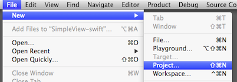
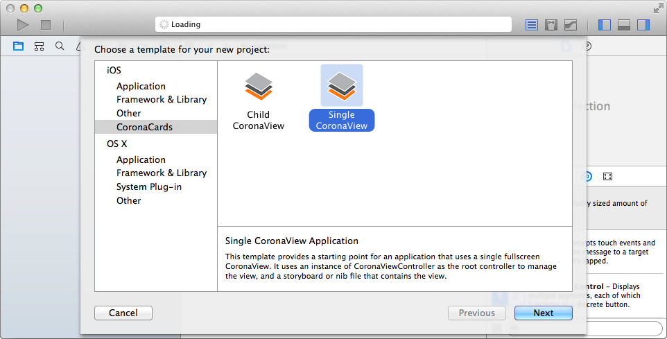

CoronaCards: Xcode Project Templates
====================

# Overview

This contains Xcode project templates for CoronaCards so you can create Xcode projects easily.

# Installation

Copy the `CoronaCards Apps` folder into the Xcode templates folder:

	`~/Library/Developer/Xcode/Templates`

NOTE: The project templates expect `CoronaCards.framework` to be installed at `/Users/Shared/CoronaLabs/ios/CoronaCards.framework`. 

# Creating a New Project

Choose the `New Project` menu item:

You should see `CoronaCards Apps` as a category in the template picker. You can choose between the `Single CoronaView` or the `Child CoronaView` template:

The rest of the process is the same as for [creating any Xcode project](https://developer.apple.com/library/ios/recipes/xcode_help-structure_navigator/articles/Creating_a_Project.html#//apple_ref/doc/uid/TP40009934-CH3-SW1). 

## Objective-C and Swift support

The CoronaCards project templates support both Objective-C and Swift. You can choose the preferred programming language via the `Language` pulldown that appears in the project options dialog:

# Requirements

* Xcode 6.1
* Mac OS X 10.9.4 or higher

